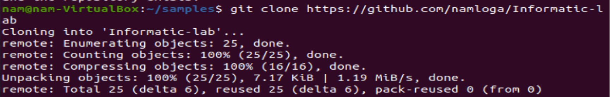
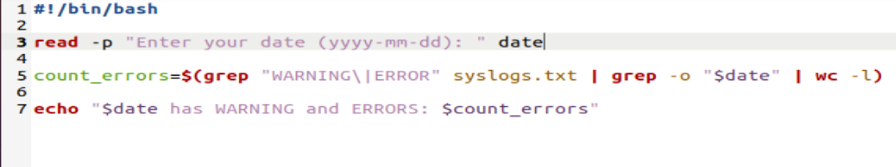
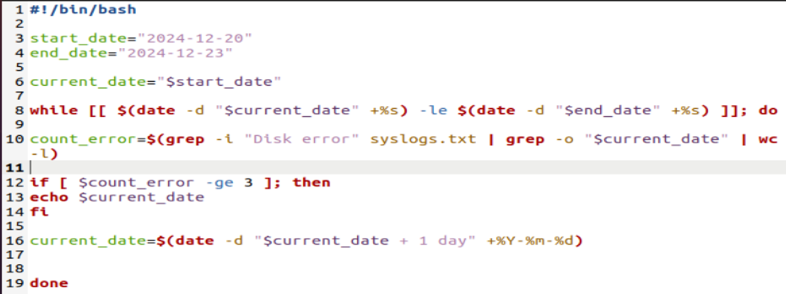
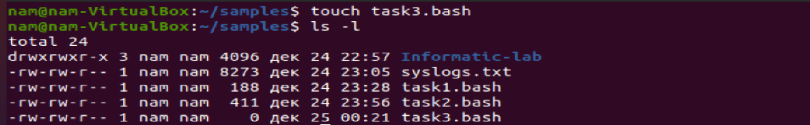
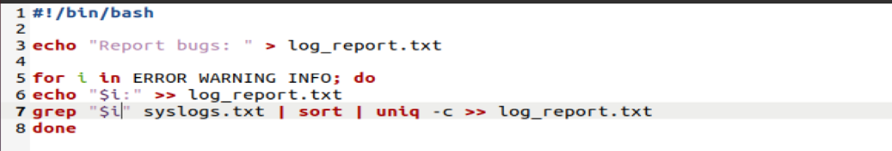
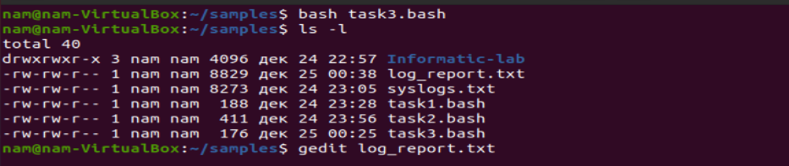
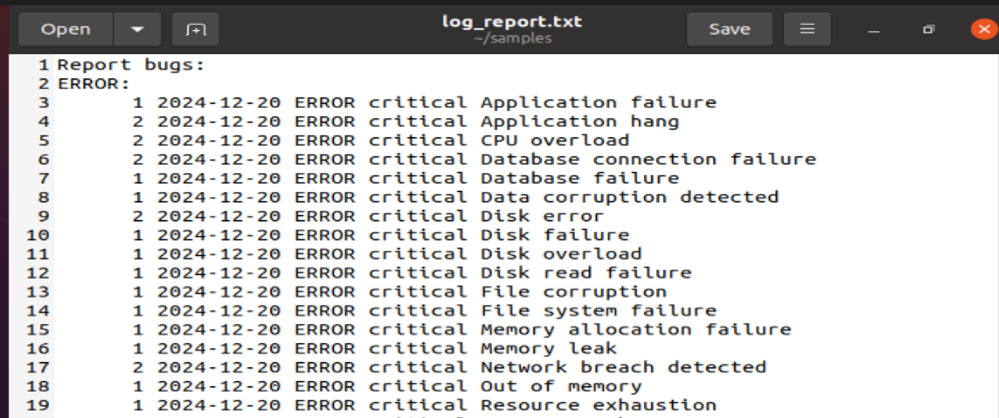
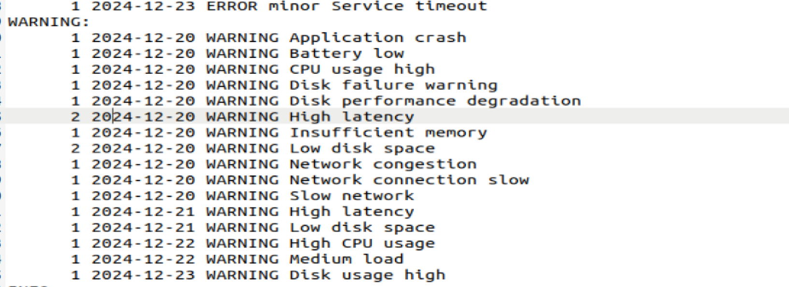
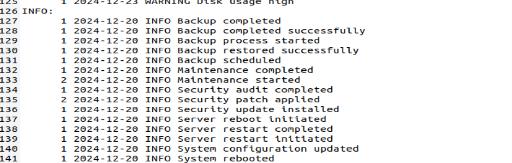

# Лабораторное рабочее решение

## ФИО: Нгуен Динь Нам - К3140

### Загрузить файл `syslogs.txt`

---

1. Сначала клонируйте проект в свою папку.

   

2. Перейдите в папку проекта. Используйте команду `ls -l`, чтобы увидеть файлы и папки в проекте. Здесь мы видим файл **syslogs.txt**.

   

3. Скопируйте этот файл и поместите его в рабочую папку.

   

### Задание 1 - Подсчитайте количество ошибок (WARNING, ERROR) за день.

---

1.  Создайте пустой файл с именем `task1.bash`. Используйте команду `ls -l`, чтобы проверить, был ли создан файл.

    

2.  Откройте файл `task1.bash`, который создал, для редактирования с помощью `gedit` и выполнения задачи.

    

- Команда read `-p "Enter your date (yyyy-mm-dd): "date` предлагает пользователю ввести дату в правильном формате и сохраняет ее в переменной date.

- Команда `grep "WARNING\|ERROR" syslogs.txt` используется для поиска ошибок WARNING и ERROR в файле `syslogs.txt`.

- Затем результат поиска этих ошибок фильтруется по дате, совпадающей с переменной `date`, введенной с помощью команды `grep -o "$date"`.

- В конце команда `wc -l` подсчитывает количество строк, содержащих ошибки WARNING и ERROR в этот день.

- Выведите результат в терминал с помощью команды 'echo'.

3. Сохраните файл. Закройте текстовый редактор `gedit`. Запустите bash-скрипт, выполнив в терминале.

```
    bash task1.bash
```

- Проверьте ошибки за 20-е число.

  

- Проверьте наличие ошибок 21-го числа.

  

### Задание 2 - Вывести дни, в которых Disk error возникала 3 или более раз с 20 по 23 декабря 2024 г.

---

1.  Создайте пустой файл с именем `task2.bash`. Используйте команду `ls -l`, чтобы проверить, был ли создан файл.

    

2.  Откройте файл `task2.bash`, который создал, для редактирования с помощью `gedit` и выполнения задачи.

    

- Установите начальную дату (**start_date**) на 20 декабря 2024 года. Установите конечную дату (**end_date**) на 23 декабря 2024 года.

- Присвойте значение **start_date** переменной **current_date**, чтобы начать цикл с 20 декабря 2024 года.

- Цикл `while` проверяет, является ли текущая дата (**current_date**) меньшей или равной конечной дате (**end_date**). Цикл будет продолжаться до тех пор, пока текущая дата не превзойдет конечную дату.

- Преобразуйте «current_date» и «end_date» в формат epoch time для сравнения.

- Найдите ошибки «Disk error» в файле `syslog.txt` с датой, соответствующей current_date

- Проверьте, превышает ли количество ошибок «Disk error» за текущий день 3. Если количество ошибок больше 3, выведите дату, когда «Disk error» возникла более 3 раз в день.

- `current_date=$(date -d "$current_date + 1 day")`. Обновите переменную `current_date`, чтобы перейти к следующему дню.

3. Сохраните файл. Закройте текстовый редактор `gedit`. Запустите bash-скрипт, выполнив в терминале.

```
    bash task2.bash
```

- И вот результат:
  

### Задание 3 - Создание отчета с статистикой ошибок и событий по уровню важности (INFO, WARNING, ERROR). (Записать в файл log_report.txt).

---

1.  Создайте пустой файл с именем `task3.bash`. Используйте команду `ls -l`, чтобы проверить, был ли создан файл.

    

2.  Откройте файл `task3.bash`, который создал, для редактирования с помощью `gedit` и выполнения задачи.

    

- `echo` записывает строку "Report bugs: " в файл `log_report.txt`. Использование `>` перезаписывает файл, т.е. если файл `log_report.txt` уже существует, он будет удален и создан заново. Если файл не существует, он будет создан.

- Цикл `for` будет поочередно принимать значения "ERROR", "WARNING" и "INFO" для переменной `i`. Цикл выполнится трижды, один раз для каждого уровня ошибки: ERROR, WARNING и INFO.

- `echo "$i: " >> log_report.txt`. Использование `>> `добавляет вывод в файл, не перезаписывая его, т.е. результат будет добавлен в конец файла.

- `grep "$i" syslogs.txt | sort | uniq -c >> log_report.txt`. Найдите все строки в файле `syslogs.txt`, содержащие слово, совпадающее со значением переменной `i`.

- Затем отсортируйте эти строки в алфавитном порядке с помощью `sort`.

- `uniq -c`: Убирает дублирующиеся строки и выводит количество их появлений. Опция `-c` выводит количество повторений каждой строки.

- Наконец, результаты добавляются в файл `log_report.txt`.

3. Сохраните файл. Закройте текстовый редактор `gedit`. Запустите bash-скрипт, выполнив в терминале.

```
    bash task3.bash
```

- И вот результат:
  

- После выполнения команды `bash task3.bash` был создан и перечислен файл `log_report`, в котором были классифицированы ошибки и важные события.

  
  
  
